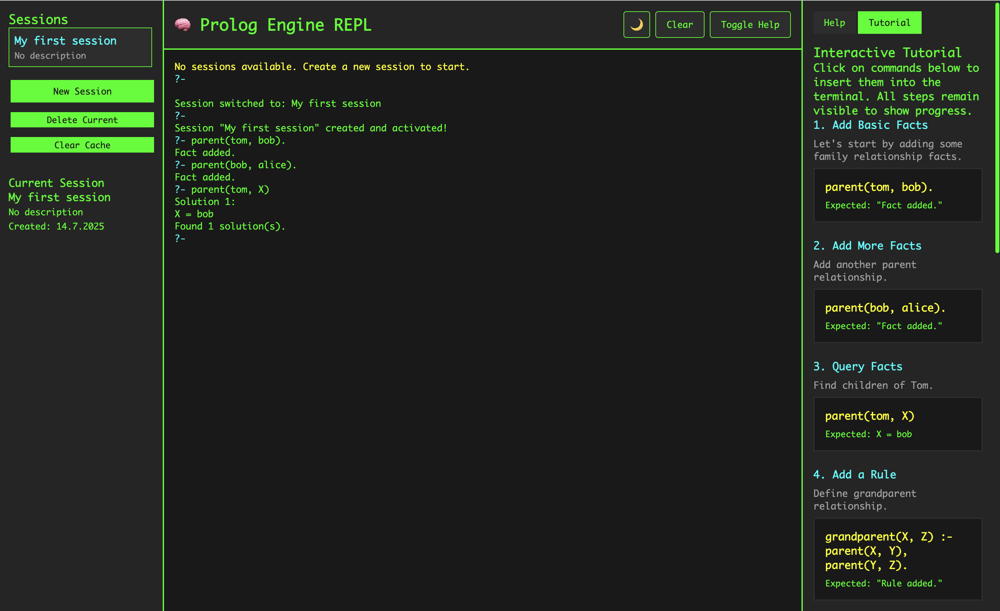
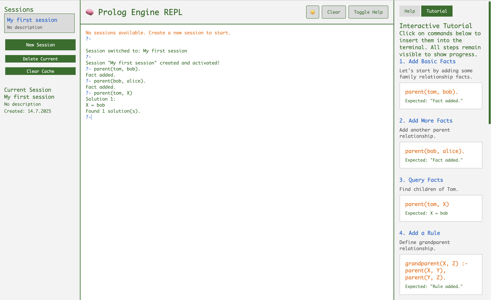

# 🧠 GoLog - Prolog Engine for LLMs

[](https://go.dev/)
[](LICENSE)
[](https://goreportcard.com/report/github.com/yourusername/golog)
[](Dockerfile)

A modern Prolog engine designed as a reasoning backend for Large Language Models (LLMs), with a clean REST API and an intuitive web UI for learning and experimentation.

## 🎯 Purpose

GoLog bridges the gap between symbolic reasoning and modern AI by providing:
- **For LLMs**: A structured reasoning engine accessible via REST API
- **For Developers**: Easy integration with AI applications needing logical inference
- **For Learners**: An interactive web UI to explore Prolog without installation hassles

## 📸 Screenshots

<table>
<tr>
<td><br/><em>Dark Theme</em></td>
<td><br/><em>Light Theme</em></td>
</tr>
</table>

## ✨ Features

### 🤖 **LLM-Ready Backend**
- RESTful API with JSON input/output
- Session-based knowledge isolation
- ULID-based session IDs for distributed systems
- Optional API key authentication
- Structured query responses perfect for LLM parsing

### 🧠 **Core Prolog Engine**
- Unification & Backtracking
- Tabling/Memoization for performance
- Built-in predicates (=, atom, var, number, now, date functions)
- Aggregation functions (count, sum, max, min)
- SQLite persistence

### 🎓 **Learning-Friendly UI**
- Browser-based terminal emulator
- Interactive tutorial with 20 step-by-step examples
- Command history with arrow keys (↑/↓)
- Dark/Light theme switcher
- Session management interface
- Clear terminal command

## 🚀 Quick Start

### Using Docker
```bash
docker run -p 8080:8080 yourusername/golog
```

### Using Make
```bash
# Clone the repository
git clone https://github.com/yourusername/golog
cd golog

# Start with UI for learning
make ui-basic

# Start API-only for LLM integration
make api-only
```

### For LLM Integration
```python
import requests

# Create a session
session = requests.post('http://localhost:8080/api/v1/sessions', 
    json={'name': 'llm-reasoning', 'description': 'LLM knowledge base'}).json()

# Add facts
requests.post(f'http://localhost:8080/api/v1/sessions/{session["id"]}/facts',
    json={'predicate': {
        'type': 'compound',
        'value': 'parent',
        'args': [
            {'type': 'atom', 'value': 'alice'},
            {'type': 'atom', 'value': 'bob'}
        ]
    }})

# Query
result = requests.post(f'http://localhost:8080/api/v1/sessions/{session["id"]}/query',
    json={'goals': [{
        'type': 'compound',
        'value': 'parent',
        'args': [
            {'type': 'variable', 'value': 'X'},
            {'type': 'atom', 'value': 'bob'}
        ]
    }]}).json()

# Returns: {"solutions": [{"bindings": {"X": {"type": "atom", "value": "alice"}}, "success": true}]}
```

## 📚 Learning Prolog

The web UI includes an interactive 20-step tutorial covering:

1. **Basic Facts** - Adding and querying simple facts
2. **Variables** - Using variables in queries
3. **Rules** - Defining relationships (like grandparent)
4. **Unification** - The = operator and pattern matching
5. **Type Checking** - atom/1, var/1, number/1 predicates
6. **Aggregations** - count/3, sum/3, max/3, min/3
7. **Date/Time** - Working with timestamps using now/1
8. **Complex Queries** - Multi-goal queries and backtracking

Access the tutorial by:
1. Opening http://localhost:8080/ui
2. Creating a new session
3. Clicking "Tutorial" in the help sidebar
4. Click any example to insert it into the terminal
5. Press Enter to execute and see results

## 🔌 API Reference

### Session Management
```bash
POST   /api/v1/sessions          # Create session (returns ULID)
GET    /api/v1/sessions          # List all sessions
GET    /api/v1/sessions/:id      # Get session details
DELETE /api/v1/sessions/:id      # Delete session
```

### Knowledge Base Operations
```bash
POST   /api/v1/sessions/:id/facts   # Add fact
POST   /api/v1/sessions/:id/rules   # Add rule
POST   /api/v1/sessions/:id/query   # Execute query
```

### Example: Creating a Rule
```json
POST /api/v1/sessions/:id/rules
{
  "head": {
    "type": "compound",
    "value": "grandparent",
    "args": [
      {"type": "variable", "value": "X"},
      {"type": "variable", "value": "Z"}
    ]
  },
  "body": [
    {
      "type": "compound",
      "value": "parent",
      "args": [
        {"type": "variable", "value": "X"},
        {"type": "variable", "value": "Y"}
      ]
    },
    {
      "type": "compound",
      "value": "parent",
      "args": [
        {"type": "variable", "value": "Y"},
        {"type": "variable", "value": "Z"}
      ]
    }
  ]
}
```

## 🔮 Coming Soon: MCP & OpenMCP Integration

We're actively developing support for the Model Context Protocol (MCP) and OpenMCP interfaces to make GoLog even easier to integrate with chatbots and AI applications:

- **MCP Support**: Native implementation of the Model Context Protocol for seamless integration with MCP-compatible AI tools
- **OpenMCP API**: RESTful interface following the OpenMCP specification, enabling:
  - Multi-language SDK support
  - Enterprise-ready authentication (API keys, JWT, OAuth2)
  - WebSocket and Server-Sent Events for real-time reasoning
  - Standardized AI-data integration patterns

This will allow GoLog to serve as a powerful reasoning backend for any MCP-compatible chatbot or LLM application, providing structured logical inference capabilities through industry-standard protocols.

## 🔧 Configuration

Environment variables (or `.env` file):
```bash
HOST=localhost          # Server host
PORT=8080               # Server port
API_KEY=secret          # Optional API key
UI_PASSWORD=admin123    # Optional UI password
ENABLE_UI=true          # Enable/disable web UI
```

## 🏗️ Architecture

- **Go + Gin**: Fast, concurrent web server
- **SQLite**: Persistent storage with session isolation
- **ULID**: Distributed-friendly session identifiers
- **Embedded UI**: Single binary deployment
- **Clean separation**: Engine, API, and UI layers

## 📦 Installation

### Prerequisites
- Go 1.22+ (for building from source)
- Docker (for container deployment)

### Build from Source
```bash
git clone https://github.com/yourusername/golog
cd golog
make deps
make build
```

### Docker Build
```bash
docker build -t golog .
docker run -p 8080:8080 golog
```

## 🤝 Contributing

Contributions are welcome! Please read our [Contributing Guide](CONTRIBUTING.md) for details on our code of conduct and the process for submitting pull requests.

## 📄 License

This project is licensed under the MIT License - see the [LICENSE](LICENSE) file for details.

## 🙏 Acknowledgments

- Inspired by the need for symbolic reasoning in modern AI systems
- Built with love for both logic programming and practical AI applications
- Special thanks to the Prolog and Go communities

---

**Made with ❤️ for the intersection of symbolic AI and neural networks**